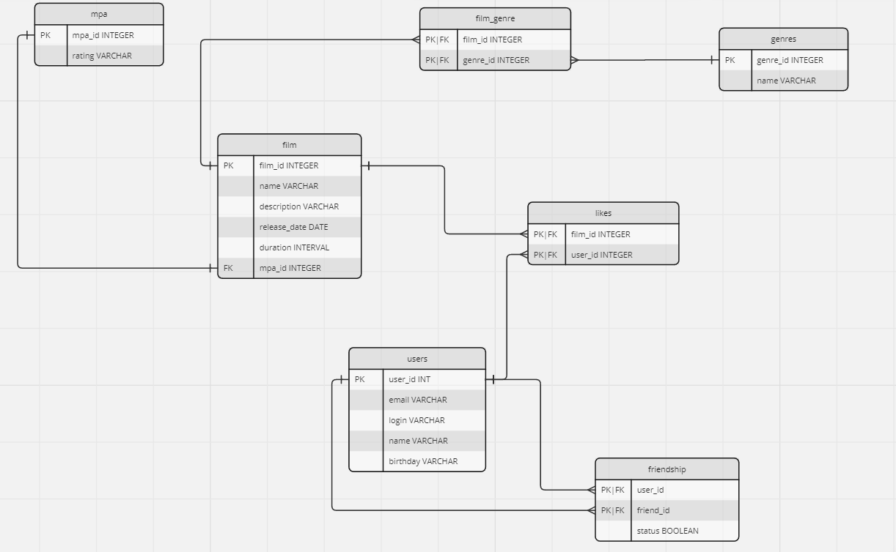

# java-filmorate
## Описание ER-диагрммы базы данных

[Ссылка на miro](https://miro.com/welcomeonboard/RWZ6WXhPZktORXg0RFVKbXhoR1hIemJGNnp4MmhtQU03VWR6SzVyZllneXJyVWVaWnZrM1hGRTBXejF6cEV5NXwzMDc0NDU3MzUyMDc1MzQ1MzQxfDI=?share_link_id=372657932937)

## Основные запросы(Dump file)
### film
```sql
create user film_admin superuser;
alter user film_admin password 'postgres';
create database filmorate with owner film_admin;
-- Создание БД и суперпользовтеля-владельца БД    

CREATE TABLE mpa 
(
    mpa_id int GENERATED BY DEFAULT AS IDENTITY PRIMARY KEY,
    rating varchar(10) NOT NULL
); -- Создание таблицы для работы с рейтингом

CREATE TABLE genres
(
    genre_id int GENERATED BY DEFAULT AS IDENTITY PRIMARY KEY,
    name varchar(100) NOT NULL 
); -- Создание таблицы для работы с жанрами фильмов TODO: создать скрипт для заполнения

CREATE TABLE films
(
    film_id int GENERATED  BY DEFAULT AS IDENTITY PRIMARY KEY,
    name varchar(255) NOT NULL,
    description varchar(255),
    release_date date NOT NULL,
    durarion interval NOT NULL CHECK ( durarion > interval '0 minutes'), -- TODO: возможно, пересмотеть вариант использования INT
    mpa_id int REFERENCES mpa (mpa_id)    
); -- Создание таблицы для работы с фильмами

CREATE TABLE film_genre
(
    film_id int NOT NULL,
    genre_id int NOT NULL,
    PRIMARY KEY (film_id, genre_id),
    FOREIGN KEY (film_id) REFERENCES films(film_id),
    FOREIGN KEY (genre_id) REFERENCES genres(genre_id)
); -- Создание таблицы связей между фильмами и жанрами

CREATE TABLE users
(
    user_id int GENERATED BY DEFAULT AS IDENTITY PRIMARY KEY,
    email varchar(200) NOT NULL,
    login varchar(255) NOT NULL,
    user_name varchar(255),
    birthday date CHECK ( birthday < current_date )
); -- Создание таблицы для работы с пользователем

CREATE TABLE likes
(
    film_id int NOT NULL,
    user_id int NOT NULL,
    PRIMARY KEY (film_id, user_id),
    FOREIGN KEY (film_id) REFERENCES films(film_id),
    FOREIGN KEY (user_id) REFERENCES users(user_id)
); -- Создание таблицы для связи лайков

CREATE TABLE friendship
(
    user_id int NOT NULL,
    friend_id int NOT NULL,
    PRIMARY KEY (user_id, friend_id),
    FOREIGN KEY (user_id) REFERENCES users(user_id),
    FOREIGN KEY (friend_id) REFERENCES users(user_id),
    status boolean
); -- Создание таблицы связей между пользователями, являющимися друзьями


INSERT INTO mpa (mpa_id, rating) values (1, 'G');
INSERT INTO mpa (mpa_id, rating) values (2, 'PG');
INSERT INTO mpa (mpa_id, rating) values (3, 'PG-13');
INSERT INTO mpa (mpa_id, rating) values (4, 'R');
INSERT INTO mpa (mpa_id, rating) values (5, 'NC-17');

INSERT INTO genres (genre_id, name) values (1, 'Комедия');
INSERT INTO genres (genre_id, name) values (2, 'Драма');
INSERT INTO genres (genre_id, name) values (3, 'Мультфильм');
INSERT INTO genres (genre_id, name) values (4, 'Триллер');
INSERT INTO genres (genre_id, name) values (5, 'Документальный');
INSERT INTO genres (genre_id, name) values (6, 'Боевик');

-- Для обновления счетчика
ALTER TABLE films ALTER COLUMN film_id RESTART WITH 1;
```

